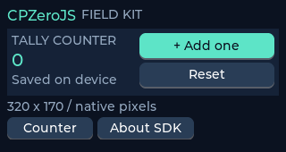

# CPZeroJS

**Build TypeScript apps for the Cardputer Zero, and preview them on your Mac.**



CPZeroJS is an application SDK and development toolchain: TypeScript app code is bundled to JavaScript, then a native C++ host runs it in QuickJS and draws the interface with LVGL. The package is an early v0.1 foundation, with a small widget set and service extension point. The native host supports an SDL desktop simulator and a Linux framebuffer backend. Physical Cardputer Zero validation is still pending.

“SDK” is the clearest name for the developer-facing library and tools. “Framework” also fits the lifecycle and UI conventions. CPZeroJS includes both.

## Start here

On macOS, install the desktop build tools, then install project dependencies and build the native host:

```sh
brew install cmake ninja sdl2 pkg-config
npm install
npm run native
npm run dev
```

Try the 10,000-item paged catalog with `npm run dev:catalog`. Run `npm run doctor` to check setup and `npm run benchmark` for the sample app's runtime allocation report.

The SDL simulator uses a fixed 320 × 170 logical display shown at 3× scale. Source edits rebuild the bundle and reload the native host; reload resets in-memory app state.

To scaffold an example beside this checkout, run:

```sh
node packages/cli/src/index.mjs init ../my-app
```

The scaffold uses local packages from this checkout, so keep the checkout available while using it. See [Getting started](docs/getting-started.md) for setup details. Build an app bundle with `cpzero build` or `npm run build` from an initialized app.

## Tiny example

```ts
import { createApp, ui, signal, bind } from "@cpzero/core";

createApp({ title: "Counter", setup(root) {
  const count = signal(0);
  const column = ui.column(root, { gap: 8, padding: 8 });
  const value = ui.label(column, { text: "0" });
  bind(value, "text", count);
  ui.button(column, { text: "Add", onPress: () => count.value++ });
}});
```

## Documentation

- [Getting started](docs/getting-started.md): install, run the example, and scaffold an app beside this checkout.
- [Architecture](docs/architecture.md): how TypeScript, QuickJS, the native bridge, and LVGL fit together.
- [API reference](docs/api.md): app lifecycle, widgets, signals, events, and timers.
- [Services](docs/services.md): extend the app with platform and application capabilities.
- [Performance](docs/performance.md): runtime behavior, resource limits, and practical guidance.
- [Device packaging](docs/device.md): ARM64 Linux package helper and hardware verification status.
- [Contributing](docs/contributing.md): repository layout and contributor workflow.
- [Implementation contract](docs/implementation-contract.md): exact v0.1 implementation interfaces and host expectations.
- [Third-party notices](docs/third-party.md): pinned dependencies and licenses.
- [PocketJS research](docs/pocketjs-research.md): comparison and design lessons from a related QuickJS/native UI runtime.

## Current scope

The host provides a small set of native LVGL widgets and a QuickJS JavaScript runtime. There is no JSX, Node.js API, browser DOM, or native network adapter in v0.1. Apps that need additional capabilities should provide a service adapter; widgets beyond the built-in set require native C++ work. The Debian packaging script requires a prebuilt Linux ARM64 host; its output and device behavior remain unverified. See [device support](docs/device.md) and [known limits](docs/architecture.md#current-limits).

The `@cpzero/core` package is the TypeScript SDK and `@cpzero/cli` provides the `cpzero` command. Build tooling runs under Node.js; app code runs inside QuickJS. A Debian packaging helper is included for an externally built ARM64 Linux host; see [Device packaging](docs/device.md). The repository does not yet establish that a packaged binary runs on the Cardputer Zero.
