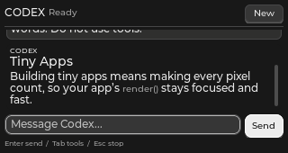

# CPZeroJS

**Small native apps. TypeScript ergonomics. Built for Cardputer Zero.**

CPZeroJS is an **application SDK and framework**: compose interfaces in TypeScript, bundle them to JavaScript, and run them inside a small C++ engine. QuickJS executes your code; LVGL draws the widgets. Preview the same 320 × 170 layout on your Mac with live reload.

This targets the **Linux-based M5Stack Cardputer Zero**, not the original Cardputer or Cardputer ADV. This is an early v0.2 SDK: the Mac simulator works; physical Zero compatibility and performance remain to be validated.



*Actual native rendering at 320 × 170, using a reply from the installed Codex CLI.*

## Run it

```sh
brew install cmake ninja sdl2 pkg-config
npm install
npm run native
npm run dev:codex
```

The Codex demo wraps your installed `codex` CLI and uses its existing login. Run `codex login` first if needed. It streams replies, interrupts turns, and presents explicit approval/input dialogs. [Codex demo guide →](docs/codex.md)

| Control | Action |
| --- | --- |
| Enter | Send from the composer |
| Tab / Shift+Tab | Move focus |
| Escape | Stop the turn / dismiss a request |
| Ctrl+N / Cmd+N | New conversation |
| Ctrl/Cmd + `+` / `-` / `0` | Zoom text in / out / reset |
| Page Up / Page Down, or Alt + arrows | Scroll the conversation |
| Ctrl/Cmd + Up / Down | Focus the previous / next tool entry |
| Enter / Space on a tool | Expand or collapse details |
| Mouse | Click controls and scroll with the wheel |

Edit an imported source file and save: the CLI rebuilds it and the native runtime reloads. Reload clears in-memory state and shuts down the old app's subprocesses. The simulator starts at 3× scale; pass `-- --scale 2` for a smaller window.

Other examples: `npm run dev` opens the dashboard; `npm run dev:catalog` opens the 10,000-item paged catalog. `npm run doctor` checks the local setup.

## Compose an app

```ts
import { createApp, ui, signal, bind } from '@cpzero/core';

createApp({ setup(root) {
  root.update({ padding: 6, gap: 4 });
  const count = signal(0);
  const card = ui.panel(root, { width: '100%', height: 80 });
  const value = ui.text(card, { text: '0', fontSize: 20 });
  bind(value, 'text', count);
  ui.button(card, {
    text: 'Add one', width: 90, height: 24,
    onPress: () => count.value++,
  });
}});
```

Use native pixel sizes, percentages, content sizing, or flex growth. Compact font sizes, wrapping, scrolling, focus, keyboard shortcuts, and widget-owned cleanup are built in. Change a widget directly or bind it to a small reactive signal—there is no virtual DOM.

To create a separate project:

```sh
node packages/cli/src/index.mjs init ../my-app
cd ../my-app
npm install
npm run dev
```

The scaffold links to this checkout. [Getting started →](docs/getting-started.md)

## What you get

- **Markdown:** bounded native rich text, headings, lists, code, quotes, emphasis and text zoom. [Markdown guide →](docs/markdown.md)
- **Native UI:** rows, columns, panels, text, buttons, inputs, bars, scrolling and bounded paged lists.
- **Themes:** semantic tokens, reusable component recipes and scoped live updates. [Theming →](docs/theming.md)
- **Networking:** asynchronous HTTP(S), verified TLS, response limits, timeouts and cancellation.
- **Processes:** argument-based spawning, streamed stdout/stderr, stdin, exit events and cleanup.
- **Integrations:** typed TypeScript services and native C++ service extensions.
- **Development:** bundle/watch CLI, native Mac/Linux simulator, screenshots, tests and a Linux ARM64 packaging helper.
- **Codex adapter:** structured app-server protocol, streamed messages, turn cancellation and explicit request routing.

Build tools use Node.js. Shipped app code runs in QuickJS; it does not have browser or Node APIs. HTTP and subprocess I/O run on a native worker. Codex is a separate executable with its own memory footprint. See the [resource limits and measurements](docs/performance.md).

## Documentation

| Read | Learn |
| --- | --- |
| [Getting started](docs/getting-started.md) | Install, scaffold, preview and build |
| [API reference](docs/api.md) | Widgets, sizing, state, events, shortcuts and timers |
| [Components](docs/components.md) | Lazy disclosures and modal focus scopes |
| [Markdown](docs/markdown.md) | Bounded parsing, native rich text and zoom |
| [Theming](docs/theming.md) | Tokens, variants, scope and the shadcn-inspired approach |
| [Recipes](docs/recipes.md) | Copyable compact app patterns |
| [Services](docs/services.md) | HTTP, processes, storage and native integrations |
| [Codex demo](docs/codex.md) | Run, customize and understand the CLI adapter |
| [Architecture](docs/architecture.md) | Engine boundaries and current limits |
| [Performance](docs/performance.md) | Budgets, complexity and measurements |
| [Device packaging](docs/device.md) | Linux ARM64 builds and hardware validation status |
| [Contributing](docs/contributing.md) | Develop and test the SDK |
| [Agent guide](AGENTS.md) | Quick rules for AI coding agents |
| [Third-party notices](docs/third-party.md) | Dependencies and licenses |
| [PocketJS research](docs/pocketjs-research.md) | Related runtime design lessons |

## Current limits

There is no React, DOM, CSS engine or direct shadcn/ui compatibility. The theme/component approach is native. Full CommonMark/HTML, arbitrary fonts, canvas drawing, audio and device-specific hardware adapters need further work. Additional native widgets and services can be added through the engine.

The framebuffer backend compiles for Linux, but the packaging helper and actual Zero display/input integration still need device testing. CPZeroJS cannot guarantee every app fits the device's memory or compute budget; bound your data and measure the complete process tree.
